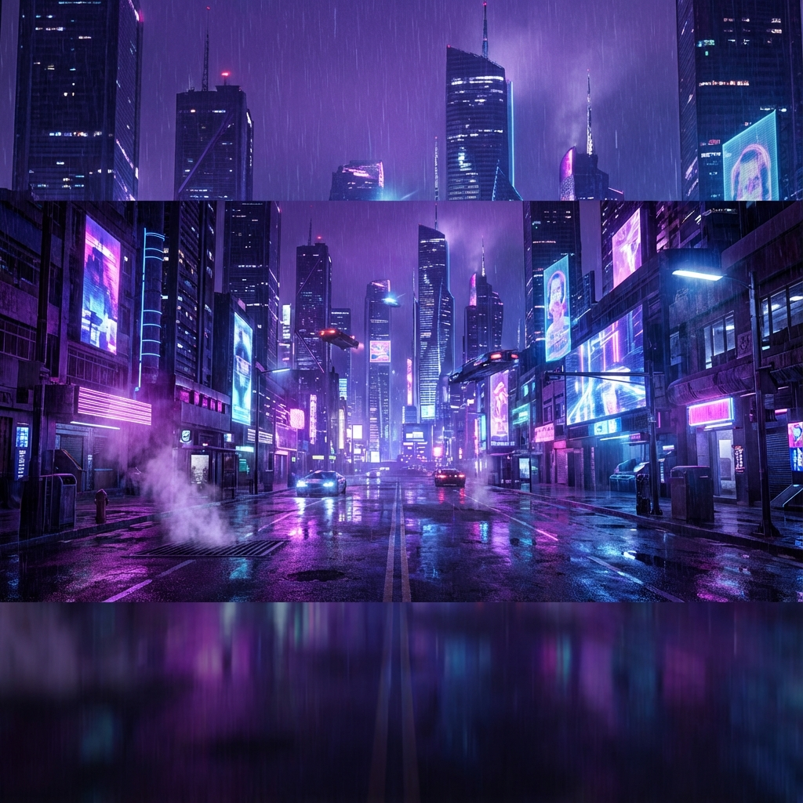
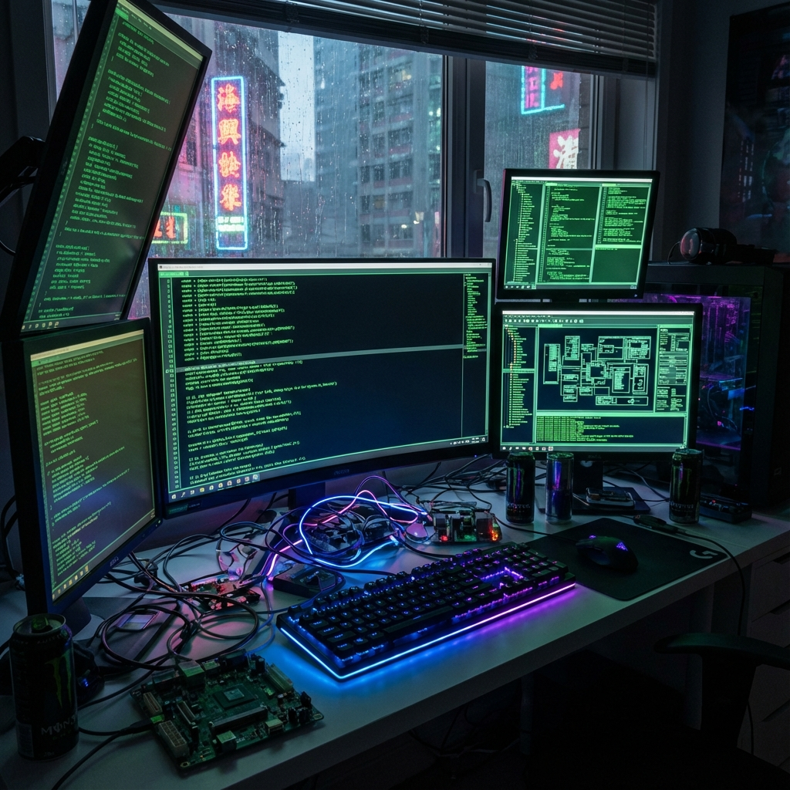

<!-- Cyberpunk Banner -->

  

<h1 align="center">⚡ ThryLox — Architect of the Neon Grid</h1>

  

  <em>Developer • Creator • Tech Explorer</em> 
  <em>Building futuristic systems in the glow of neon light.</em>

---

## 🟣 Who Am I?

I'm a developer who loves crafting sleek, modern, and visually striking digital experiences.  
I explore frameworks, design trends, system architecture, automation, and emerging tools — always aiming to build something better, faster, and cooler than before.

**Core things about me:**
- 🔥 Passion for UI/UX and futuristic aesthetics  
- ⚙️ Constantly improving my coding skills  
- 🚀 Obsessed with turning ideas into real projects  
- 🧠 Forever learning, experimenting, and pushing boundaries  

---

## 🐍 Contribution Graph  

  

---

## 🧰 Tech Arsenal  

### ⚙️ Languages & Frameworks  

### 🛠️ Tools & Platforms  

---

## 🔥 System Analytics

 

---

## 🚀 Featured Projects  

> *A curated selection of what I’m proud of.*

### 🌐 [Ekonkar Systems](https://www.ekonkar.systems)
My personal portfolio showcasing my journey, skills, and projects. Built with modern web technologies and a focus on immersive design.

### 📈 StockML
An advanced stock analysis tool leveraging machine learning to predict market trends and provide actionable insights.

### 🛡️ Sentinel Agent
A powerful AI agent designed for autonomous monitoring and response, pushing the boundaries of what automated systems can achieve.

---

## 💬 System Log  

Initializing profile...  
Establishing neural uplink...  
Repositories synchronized.  
Status: **Online** — Welcome to the Neon Grid.

---

## 🎧 Daily Neon Vibe  

  

---

  🚀 Crafted with neon, logic, and a spark of chaos.

