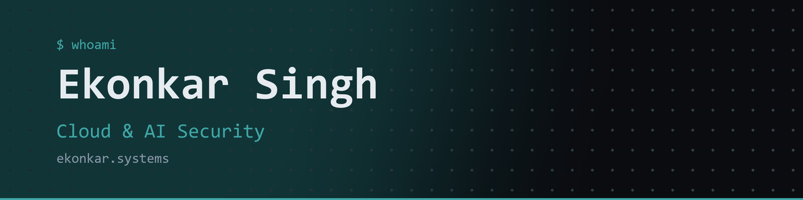

  

  

  
  
  

Cloud and AI security analyst based in Ottawa. I turn written security requirements into Policy-as-Code and build the tooling around it in Python, PowerShell, C# and Go. Outside work I focus on AI security and red-teaming.

  

## Open-source contributions

Merged pull requests to projects I use:

- **[microsoft/PyRIT](https://github.com/microsoft/PyRIT/pull/2169)**: clamp `ImageResizingConverter` output dimensions
- **[projectdiscovery/httpx](https://github.com/projectdiscovery/httpx/pull/2524)**: preserve case sensitivity for the `match-regex` and `filter-regex` flags
- **[projectdiscovery/uncover](https://github.com/projectdiscovery/uncover/pull/746)**: CSV output with customizable fields
- **[hashicorp/terraform-provider-azurerm](https://github.com/hashicorp/terraform-provider-azurerm/pull/32690)**: allow `key_size` for `oct-HSM` keys on Key Vault Managed HSM

## Projects

  
  

  
  

  
  

## Research

- *Contrastive Representation Learning for Network Flow Anomaly Detection Under Distribution Shift*, presented at CCIDSA 2026.

## Certifications

Microsoft Cybersecurity Architect Expert (SC-100) · Identity and Access Administrator (SC-300) · Fabric Analytics Engineer (DP-600) · CompTIA Security+ · ITIL v4 Foundation
